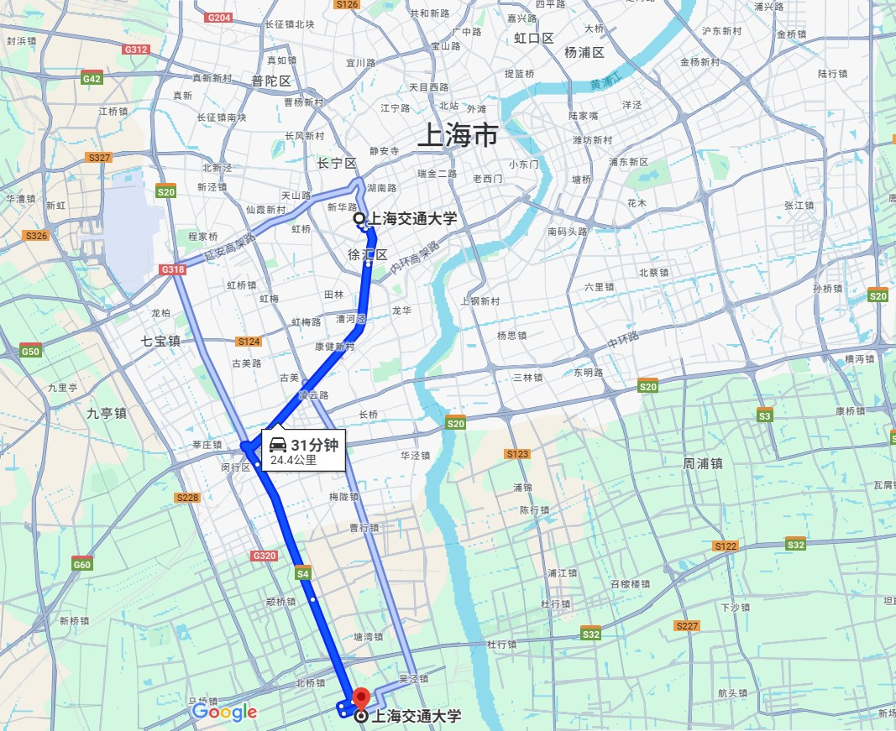
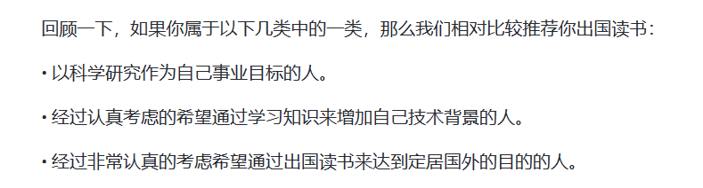
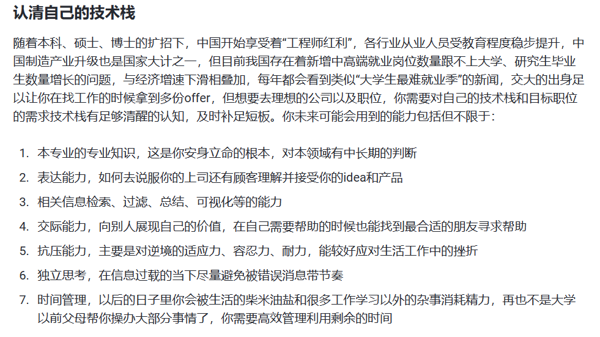
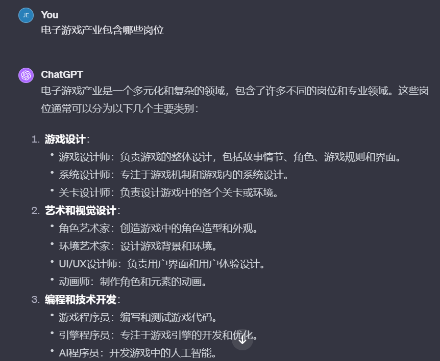
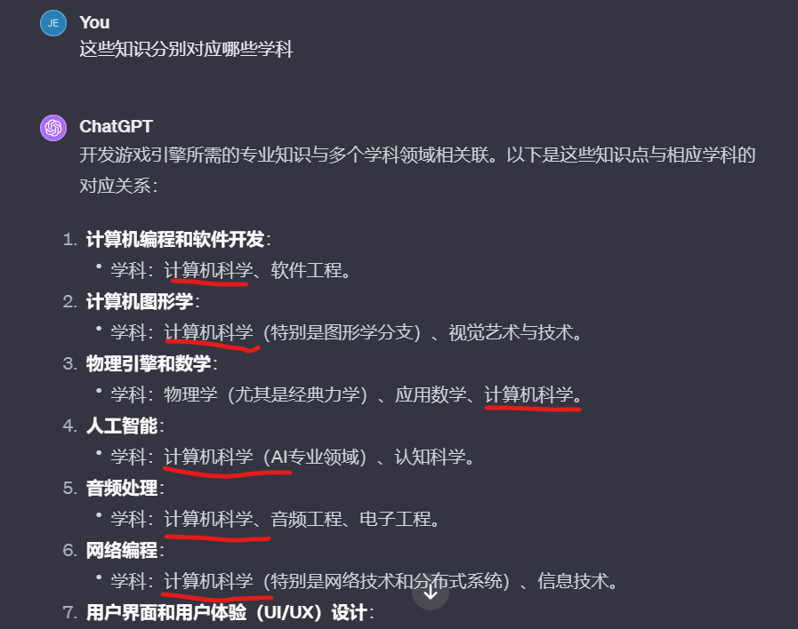
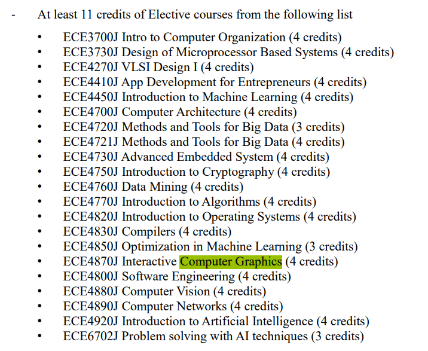
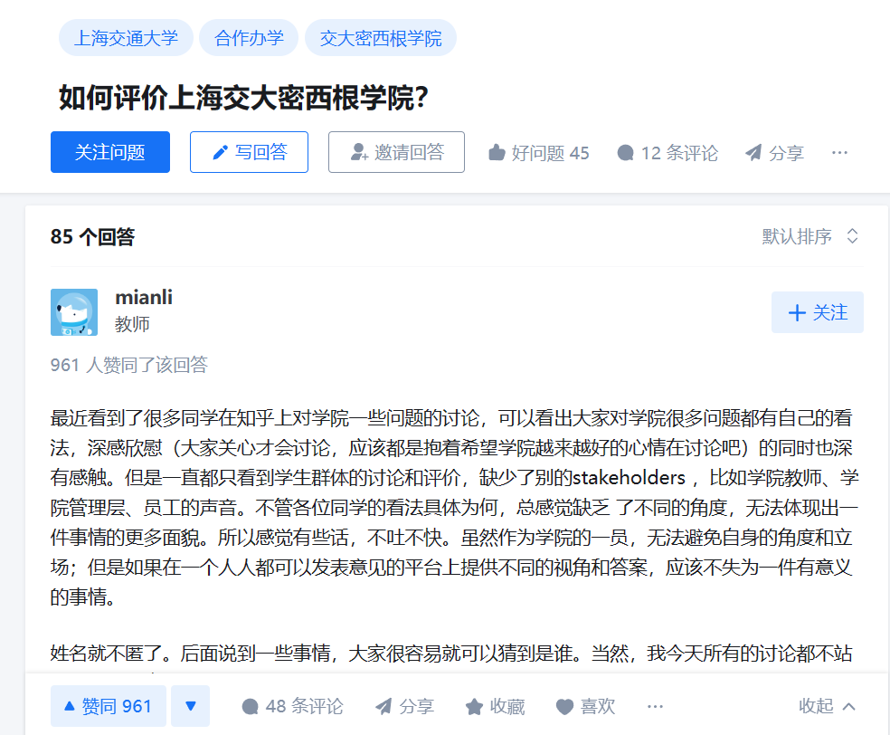

# 写在前面
1. 具体地提问
2. 记笔记
3. 谨慎地接受建议

---
# 讲点虚的
### 王润秋
---
## 不讲学习,
### Just chill out!
---
<!-- paginate: true -->
<!-- _header: 我们在为什么而努力？ -->
# 为什么要考高分？
---
<!-- _header: 我们在为什么而努力？ -->
# 为什么要考高分？
## 装逼？
## 获得更大的择校选择权！
---
<!-- _header: 中国大学生择校过程存在哪些问题？-->
# 中国大学生择校过程存在哪些问题？
0. 为什么我建议大家从高考前就开始考虑择校的事情
    - 各种计划的报名时间在高考前
    - Keep motivated
    - 高考完并不适合做决策
---
<!-- _header: 中国大学生择校过程存在哪些问题？-->
## 1. 害怕“浪费分数”
- 清北、华五、C9、985、211......
- “学校之间的差别只有在家长之间相互吹牛逼的时候好使。”——张雪峰
---
<!-- _header: 中国大学生择校过程存在哪些问题？-->
## 2. 对专业缺乏了解
- 来自家长和老师的经验无法提供太多帮助
- 在高中不能获得与专业相关的知识
---
<!-- _header: 中国大学生择校过程存在哪些问题？-->
## 核心原因：没有想清楚自己想要什么
- 从小学到高中，教育其实都是为了高考服务

---
<!-- _header: 为什么我们要有梦想？-->
### 假如你的梦想是成为世界首富：
1. 具体化：
    - 成为马斯克还是巴菲特?
    - 什么时候达成这个目标?
2. 列出计划：
    - 倒推

---
<!-- _header: 国外学生是如何择校的-->
## 密歇根大学申请文书

- Describe the unique qualities that attract you to the specific undergraduate College or School to which you are applying at the University of Michigan. How would that curriculum support your interests? (描述吸引你申请密歇根大学特定本科学院或学校的独特品质。那个课程体系将如何支持你的兴趣？)
---
<!-- _header: 国外学生是如何择校的-->
### 回答这个问题：
1. 为什么选择这所学校
2. 为什么选择这个专业

---
<!-- _header: Why school-->

### 为什么要选择这所学校
1. 资源（哪些资源对你有用？）
    - 学术资源
    - 隐形资源
        - 声望
        - 机会

---
<!-- _header: Why school-->
2. 学校文化（没啥区别）
    - 学术氛围
    - 校友网络

3. 地理
    - 气候
    - 区位

---
<!-- _header: Why school-->

---
<!-- _header: Why school-->
#### 其他可能的选择
1. 各种计划
    - 强基计划（明年4月份左右）
    - 综合评价
    - 专项计划（参考本省政策）
2. 港校
    - “港三”：香港大学、香港科技大学、香港中文大学
    - 经济：申请费450HKD，学费15-20k HKD/年，有奖学金

> 早做打算

---
<!-- _header: Why major-->

### 为什么要选择这个专业
1. 前途
    - 本科之后干什么
        - 就业
            - 考公/考编
            - 找工作
        - 深造
            - 直博
            - 保研
            - 考研
            - 留学

总之：工业界 or 学术界 or 编制

---
<!-- _header: Why major-->
- 为什么留学(参考**上海交通大学生存手册**)

---
<!-- _header: Why major-->
2. 兴趣: 喜欢学=适合深入这个领域？
    - 兴趣建立在了解上
    - 哪些兴趣适合作为你的专业
3. 能力（不作为主要依据）
    - 参考[**上海交通大学生存手册-认清自己的技术栈**](https://survivesjtu.gitbook.io/survivesjtumanual/li-zhi-pian/ben-ke-si-nian-yao-zuo-shen-me)

    

---
<!-- _header: 资源获取-->
## 如何获取你需要的资源：
### 初步了解（缩小范围）
1. 善用搜索引擎
    - 能用谷歌就别用必应，能用必应就别用百度
    - 主要用于查找时效性强的资料（政策、培养方案）
2. **ChatGPT**（唯一真神）
    - 你必须学会使用的工具
    - 用于了解自己是否适合该专业
    - 英文回答更准确
3. 张雪峰（直播切片）
    - 实用主义
    - 了解专业的前途
---
<!-- _header: 资源获取-->
### 确定了所有可能的选项之后：
1. 学校官网
    - 专业相关内容
    - 国际交流项目
2. （对相关专业有所了解的）老师、学长、家人
    - 了解专业的学习路径、学习心得、出路
    - 注意信息的时效性
3. 知乎、哔哩哔哩 （慎用）

---
<!-- _header: 举例-->

# 如何通过你的兴趣确定你的专业：以电子游戏为例
1. 电子游戏产业包含哪些岗位(ChatGPT)

---
<!-- _header: 举例-->

## 假设你想要从事*编程和技术开发*
2. 问到你完全理解这个岗位是做什么的为止

---
<!-- _header: 举例-->

## 假设你确定*开发游戏引擎*这是你的兴趣：
3. 弄清楚这些对应什么学科

### 至此，*计算机科学*就可以被你加到愿望单里了。

---
<!-- _header: 举例-->

### 高考出分后：
4. 研究目标学校的培养方案是否包含你需要的课
    - 通过搜索引擎找到学生手册/培养方案

---
<!-- _header: 举例-->
5. 通过学长/老师/知乎了解相关学院/专业的教学/就业情况

### 至此，你基本可以确定要不要报这个专业了。

---
<!-- _header: 资源获取-->
## 你上大学之前一定要阅读的资料
1. [**上海交通大学生存手册**](https://survivesjtu.gitbook.io/survivesjtumanual/)
2. [上海交通大学飞跃手册](https://survivesjtu.github.io/SJTU-Application/#/)
3. （针对计算机学生）[CS自救指南 by PKUFlyingPig](https://csdiy.wiki/)

---
<!-- _header: Q&A-->
# 讲了这么多，你应该知道：
1. 考上不同学校意味着什么
2. 如何选择适合你的学校
3. 如何确定自己的学习路径
4. **选复旦还是交大？**

## 联系方式
- 手机/微信 18811106065
- 邮箱 helloworldwrq@sjtu.edu.cn
---

# 希望在盛夏的思源湖再见到大家!

